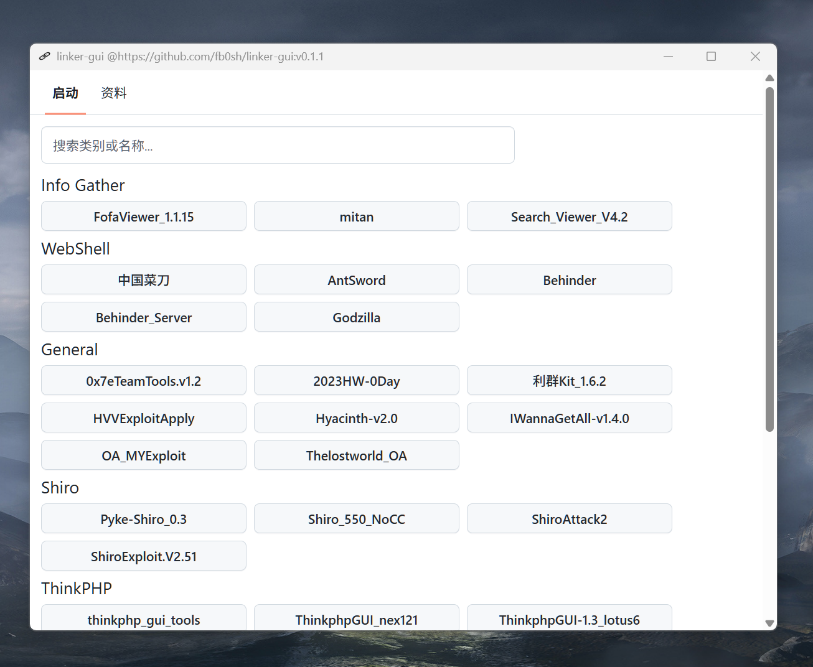

<h1 align="center">
  
  <br>
  Linker-GUI
  <br>
</h1>

<h3 align="center">
A Linker-GUI based on <a href="https://github.com/tauri-apps/tauri">Tauri</a>.
</h3>

## Preview

## Install

请到发布页面下载：[Release page](https://github.com/fb0sh/linker-gui/releases)<br>
工具和启动器需要分开下载


## Development

See [CONTRIBUTING.md](./CONTRIBUTING.md) for more details.

To run the development server, execute the following commands after all prerequisites for **Tauri** are installed:

```shell
pnpm i
pnpm run check
pnpm dev
```

## Contributions

Issue and PR welcome!

## Acknowledgement

Linker-GUI was based on or inspired by these projects and so on:

- [tauri-apps/tauri](https://github.com/tauri-apps/tauri): Build smaller, faster, and more secure desktop applications with a web
- [vitejs/vite](https://github.com/vitejs/vite): Next generation frontend tooling. It's fast!

## License

GPL-3.0 License. See [License here](./LICENSE) for details.