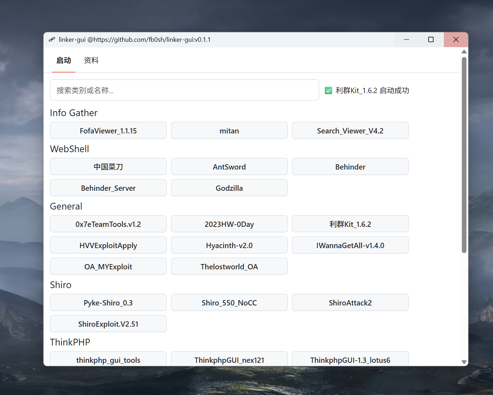

<h1 align="center">
  
  <br>
  Linker-GUI
  <br>
</h1>

<h3 align="center">
A Linker-GUI based on <a href="https://github.com/tauri-apps/tauri">Tauri</a>.
</h3>


## Preview
## master view

## launch

## search for 

## Install

请到发布页面下载：[Release page](https://github.com/fb0sh/linker-gui/releases)<br>
工具和启动器需要分开下载


## Configure
配置linker-gui.exe 相对目录下的 linker.toml<br>
请充分尊重工具作者，标注来源
```toml
[linker]
version = "0.1.1"
name = "linker"
root = "E:/tools"
categories = [ "Info Gather" ]
references_categories = ["文档", "工具", "poc", "exp"]

[langs]
#  # linux xdg-open# home 为空 则说明在系统环境变量中
system = { home = "", bin = "cmd.exe", opts = ["/C", "start"] }
java8 = { home = "env/jdk-1.8", bin = "bin/java.exe", opts = ["-jar"] }
java11 = { home = "env/jdk-11", bin = "bin/java.exe", opts = ["-jar"] }
python3 = { home = "", bin = "python.exe" }

[references]
exploitdb = { category = "exp", link = "https://www.exploit-db.com/" }

[weapons]
# Info Gather
"Search_Viewer_V4.2" = { category = "Info Gather", home = "info", lang = "system", file = "Search_Viewer_V4.2.exe", src = "https://github.com/G3et/Search_Viewer" }
"FofaViewer_1.1.15" = { category = "Info Gather", home = "info/FofaViewer_1.1.15_JDK8", lang = "java8", file = "fofaviewer.jar", src = "https://github.com/wgpsec/fofa_viewer" }
"mitan" = { category = "Info Gather", home = "info/mitan", lang = "java8", file = "mitan-jar-with-dependencies.jar", src = "https://github.com/kkbo8005/mitan" }

"some_full" = {
    category = "Info Gather", 
    home = "info/mitan", 
    lang = "java8", lang_opts=[],
    file = "mitan-jar-with-dependencies.jar", opts = [],
    src = "https://github.com/kkbo8005/mitan"
}
```
## Advantages
- 性能友好
- 配置度更高
- 更友好的界面
- 使用toml配置

## Development

See [CONTRIBUTING.md](./CONTRIBUTING.md) for more details.

To run the development server, execute the following commands after all prerequisites for **Tauri** are installed:

```shell
pnpm i
pnpm run check
pnpm dev
```

## Contributions

Issue and PR welcome!

## Acknowledgement

Linker-GUI was based on or inspired by these projects and so on:

- [tauri-apps/tauri](https://github.com/tauri-apps/tauri): Build smaller, faster, and more secure desktop applications with a web
- [vitejs/vite](https://github.com/vitejs/vite): Next generation frontend tooling. It's fast!

## License

GPL-3.0 License. See [License here](./LICENSE) for details.